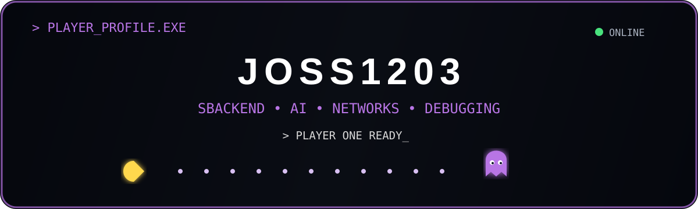

<p align="center">
  
</p>


<br>

`CODE` • `CREATE` • `LEARN` • `REPEAT`

</div>

---


<p align="center">
  <i>Every contribution gives Player 01 more XP.</i>
</p>

<div align="center">


</div>

<h2 align="center"> PROFILE</h2>

```text
PLAYER       Jocelyn

LOCATION     Mexico 🇲🇽
STATUS       ● ONLINE
MISSION      Build • Learn • Create

